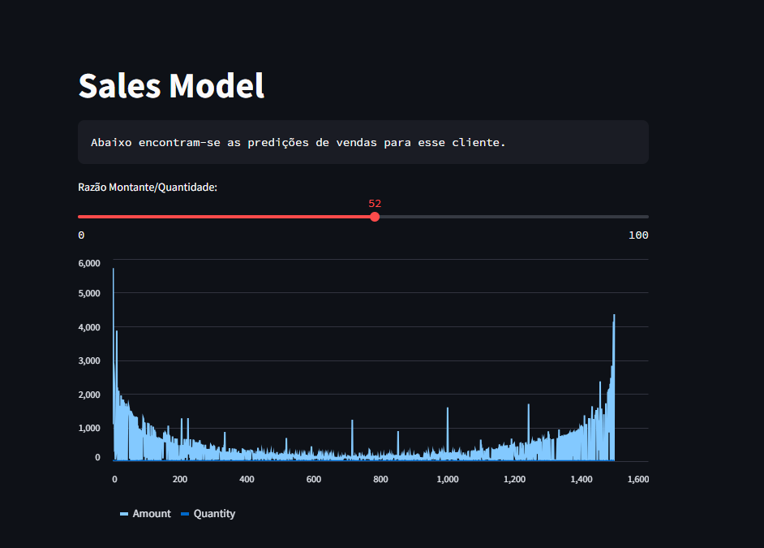

### Projeto de teste para aprofundar o conhecimento em libs de Python via Steamlit

1. No terminal, iniciar um ambiente virtual VENV via linha de comando: 
    ~~~
`python -m venv venv`
~~~
2. Ativar o ambiente virtual: 
~~~ 
`source venv/Scripts/activate` 
~~~
3. Criar o script no explorer do vscode que irá rodar no ambiente do projeto (script.py);
4. Instalar a dependência do Streamlit via terminal: 
   ~~~ 
   `pip install streamlit` 
   ~~~
5. Chegou a hora de testar o script: "streamlit run script.py" no console;
6. Instalar a dependência do pandas, para produção de dados relacionais (tabulares);

#### Segue abaixo o modelo abordado,  com as devidas modificações necessárias:

